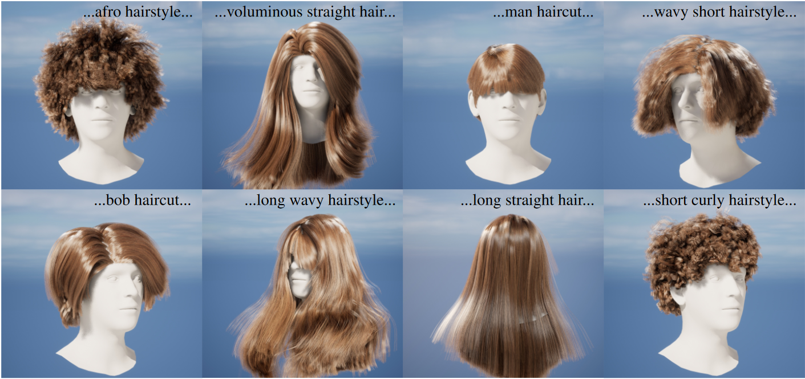

## :woman: HAAR: Text-Conditioned Generative Model of 3D Strand-based Human Hairstyles (CVPR 2024)

*Generation of 3D strand-based hairstyles from text.*


[[Paper](https://arxiv.org/abs/2312.11666)] [[Project Page](https://haar.is.tue.mpg.de/)] [[Video](https://www.youtube.com/watch?v=mR96dqO2j88)]

<p align="left"> 

</p>


## Getting started


Clone the repository and install requirements: 

```bash
git clone https://github.com/Vanessik/HAAR
cd HAAR
conda env create -f enivironment.yml
conda activate haar
```


Initialize submodules of [k-diffusion](https://github.com/crowsonkb/k-diffusion),  [NeuralHaircut](https://github.com/SamsungLabs/NeuralHaircut), [LAVIS](https://github.com/salesforce/LAVIS), [LLaVA](https://github.com/haotian-liu/LLaVA).

```bash
git submodule update --init --recursive
```

Download the pretrained strand prior model from NeuralHaircut, diffusion checkpoint of HAAR model and HAAR data:

```bash
bash scripts/download.sh
```

## Requirements

The code was tested on an NVIDIA A100 40GB GPU, and the environment specified in environment.yml is intended for Linux. 


## Data structure

The full repository structure is organized as follows:


```
|-- src
    |-- utils
    |-- openaimodel.py
    |-- sampler.py
    |-- upsampling.py
        |-- upsampler.py
        |-- utils.py
    
    |-- datasets
        |-- dataset.py
        |-- aug_dataset.py
    
|-- data 
|-- examples

|-- pretrained_models
    |-- strand_prior
    |-- haar_prior

|-- applications
    |-- image2hairstyle.py
    |-- imagic_interpolation.py
    |-- text_interpolation.py
    
|-- preprocess_dataset
|-- configs
|-- scripts
|-- train.py
|-- infer.py

|-- environment.yml
```


## Usage:

- For inference use the following command:

```bash
bash ./scripts/infer.sh
```
or

```bash
python infer.py --exp_name infer_haar --conf ./configs/infer.json --ckpt_path ./pretrained_models/haar_prior/haar_diffusion.pth --cfg_scale {CFG_SCALE} --save_latent_textures --save_guiding_strands --save_upsampled_hairstyle --upsample_resolution 64 --n_samples {NUM_VARIATIONS} --hairstyle_description {HAISRTYLE_DESCRIPTION}
```

###### Example:

```bash
python infer.py --exp_name infer_haar --conf ./configs/infer.json --ckpt_path ./pretrained_models/haar_prior/haar_diffusion.pth --cfg_scale 1.5 --save_latent_textures --save_guiding_strands --save_upsampled_hairstyle --upsample_resolution 64 --n_samples 10 --hairstyle_description "a woman with short straight hairstyle"
```

For more information on parameters:

```bash
python infer.py --help
```


## Applications:

- Interpolate hairstyle between two text prompts:

```bash
python ./applications/text_interpolation.py --conf ./configs/infer.json  --hairstyle_1 'straight woman hairstyle' --hairstyle_2 'long wavy haircut' --save_guiding_strands --save_upsampled_hairstyle --save_latent_textures --upsample_resolution 128 --cfg_scale 1.5 --seed 32 --n_interpolation_states 5
```

- Editing of hairstyle with text prompt:

```bash
python ./applications/imagic_interpolation.py  --conf ./configs/infer.json --hairstyle_edit_prompt 'short hairstyle' --target_hairstyle_texture 'exp_texture.pt' --save_guiding_strands --save_upsampled_hairstyle --save_latent_textures --upsample_resolution 128 --cfg_scale 1.5 --seed 32 --n_interpolation_states 5
```

- Create hairstyle using an input image:

From input image obtain description of hairstyle using [LLaVA](https://github.com/haotian-liu/LLaVA) and then create strand-based hairstyle from description.

```bash
bash scripts/image2hairstyle.sh
```

## Train HAAR on your data:

More information can be found in [preprocess_dataset](./preprocess_dataset).


For training use the following command:

```bash
bash scripts/train.sh
```


## License

This code and model are available for scientific research purposes as defined in the LICENSE.txt file. 
By downloading and using the project you agree to the terms in the LICENSE.txt.


## Links

This work is based on the great projects:

- [NeuralHaircut](https://github.com/SamsungLabs/NeuralHaircut) for strand-based prior model;

- [LAVIS](https://github.com/salesforce/LAVIS) for calculation of text embeddings;

- [k-diffusion](https://github.com/crowsonkb/k-diffusion) for diffusion network;

- [LLaVA](https://github.com/haotian-liu/LLaVA) for hairstyle annotation;


## Related projects

- [NeuralHaircut](https://github.com/SamsungLabs/NeuralHaircut) reconstructs strand-based hairstyle using multi-view data or monocular video;
- [GaussianHaircut](https://eth-ait.github.io/GaussianHaircut) improves reconstructions from monocular video using gaussian splatting;


## Citation


Cite as below if you find this repository is helpful to your project:

```
@InProceedings{Sklyarova_2024_CVPR,
    author    = {Sklyarova, Vanessa and Zakharov, Egor and Hilliges, Otmar and Black, Michael J. and Thies, Justus},
    title     = {Text-Conditioned Generative Model of 3D Strand-based Human Hairstyles},
    booktitle = {Proceedings of the IEEE/CVF Conference on Computer Vision and Pattern Recognition (CVPR)},
    month     = {June},
    year      = {2024},
    pages     = {4703-4712}
}
```
